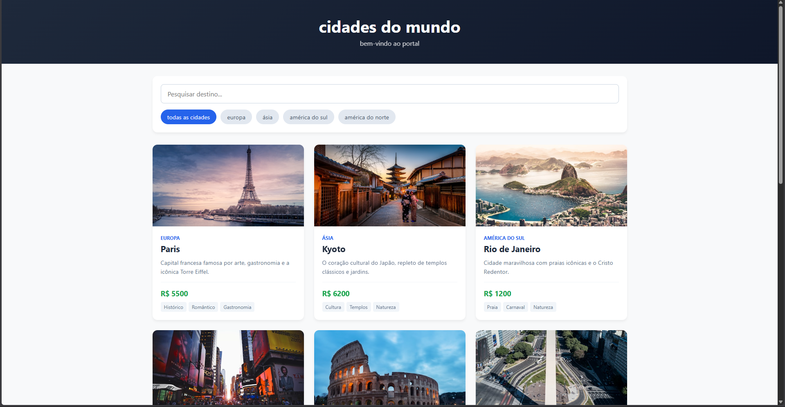
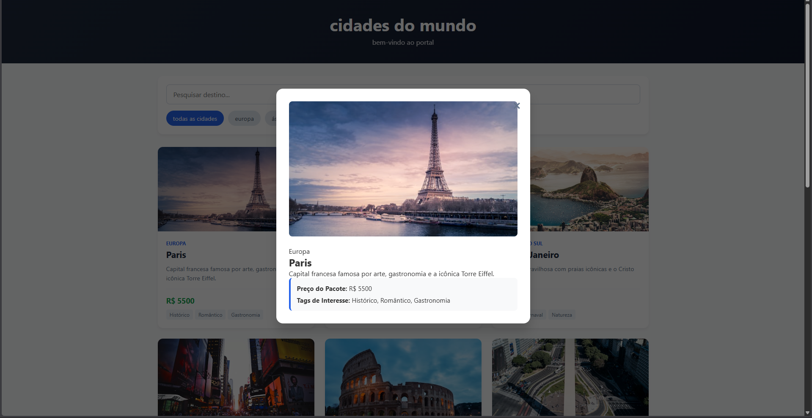

[](https://classroom.github.com/a/3AYGT_Y7)
# Trabalho Prático - Semana 13

Nessa etapa, você irá evoluir o projeto do semestre, montando o ambiente de desenvolvimento mais completo, típico de projetos profissionais. Nesse processo, vamos utilizar um **servidor backend simulado** com o JSON Server que fornece uma APIs RESTful a partir de um arquivo JSON.

Para esse projeto, além de mudarmos o JSON para o JSON Server, vamos permitir o cadastro e alteração de dados da entidade principal (CRUD).

## Informações do trabalho

- Nome:Rafael Lima Pais
- Matricula:928393
- Proposta de projeto escolhida:site de preços de viagem
- Breve descrição sobre seu projeto:fiz um site com as principais cidades do mundo e seu preço de passagem

**Registros do trabalho**

<< DADOS DO DB.JSON (ENTIDADE PRINCIPAL E SECUNDÁRIA) >>

```json
{
  "usuarios": [
    {
      "id": "187cb7e5-e097-4224-8bc7-b610c855e2b1",
      "login": "admin",
      "senha": "123",
      "nome": "Administrador do Sistema",
      "email": "admin@abc.com"
    },
    {
      "id": "ec37c83d-4b7f-458d-9e10-3fda7d37cd3e",
      "login": "user",
      "senha": "123",
      "nome": "Usuario Comum",
      "email": "user@abc.com"
    }
  ],
  "cidades": [
    {
      "id": 1,
      "nome": "Paris",
      "descricaoCurta": "Capital francesa famosa por arte, gastronomia e a icônica Torre Eiffel.",
      "descricaoCompleta": "Paris oferece museus de classe mundial como o Louvre, boulevards arborizados e cafés charmosos. Ideal para quem busca história, cultura rica e experiências gastronomicas inesquecíveis.",
      "categoria": "Europa",
      "preco": 5500,
      "imagem": "https://images.unsplash.com/photo-1502602898657-3e91760cbb34?w=500",
      "tags": ["Histórico", "Romântico", "Gastronomia"],
      "destaque": true
    },
    {
      "id": 2,
      "nome": "Kyoto",
      "descricaoCurta": "O coração cultural do Japão, repleto de templos clássicos e jardins.",
      "descricaoCompleta": "Kyoto é famosa por seus inúmeros templos budistas clássicos, jardins imperiais, santuários xintoístas e casas de madeira tradicionais. É o lugar perfeito para vivenciar a cultura tradicional japonesa.",
      "categoria": "Ásia",
      "preco": 6200,
      "imagem": "https://images.unsplash.com/photo-1493976040374-85c8e12f0c0e?w=500",
      "tags": ["Cultura", "Templos", "Natureza"],
      "destaque": true
    },
    {
      "id": 3,
      "nome": "Rio de Janeiro",
      "descricaoCurta": "Cidade maravilhosa com praias icônicas e o Cristo Redentor.",
      "descricaoCompleta": "O Rio de Janeiro é uma grande cidade brasileira à beira-mar, famosa pelas praias de Copacabana e Ipanema, pela estátua do Cristo Redentor e pelo Pão de Açúcar. Vibração cultural única e paisagens naturais incríveis.",
      "categoria": "América do Sul",
      "preco": 1200,
      "imagem": "https://images.unsplash.com/photo-1483729558449-99ef09a8c325?w=500",
      "tags": ["Praia", "Carnaval", "Natureza"],
      "destaque": false
    },
    {
      "id": 4,
      "nome": "Nova York",
      "descricaoCurta": "A cidade que nunca dorme, polo global de cultura e finanças.",
      "descricaoCompleta": "Nova York abriga pontos famosos como a Times Square, Central Park e a Estátua da Liberdade. Uma metrópole vibrante repleta de teatros da Broadway, museus e restaurantes de todas as culturas do mundo.",
      "categoria": "América do Norte",
      "preco": 7000,
      "imagem": "https://images.unsplash.com/photo-1496442226666-8d4d0e62e6e9?w=500",
      "tags": ["Moderna", "Compras", "Teatro"],
      "destaque": true
    },
    {
      "id": 5,
      "nome": "Roma",
      "descricaoCurta": "Uma cidade cosmopolita com quase 3.000 anos de arte e arquitetura.",
      "descricaoCompleta": "Roma, a capital da Itália, exibe ruínas antigas como o Fórum e o Coliseu que evocam o poder do antigo Império Romano. A cidade também é famosa pela culinária italiana autêntica e pelo Vaticano.",
      "categoria": "Europa",
      "preco": 4800,
      "imagem": "https://images.unsplash.com/photo-1552832230-c0197dd311b5?w=500",
      "tags": ["Histórico", "Arqueologia", "Gastronomia"],
      "destaque": false
    },
    {
      "id": 6,
      "nome": "Buenos Aires",
      "descricaoCurta": "A capital do tango, conhecida por sua arquitetura de estilo europeu.",
      "descricaoCompleta": "Buenos Aires é uma cidade vibrante com uma forte identidade cultural, famosa por seus shows de tango, bairros coloridos como o Caminito, livrarias majestosas e carnes de alta qualidade.",
      "categoria": "América do Sul",
      "preco": 2200,
      "imagem": "https://images.unsplash.com/photo-1589909202802-8f4aadce1849?w=500",
      "tags": ["Tango", "Cultura", "Econômico"],
      "destaque": false
    },
    {
      "id": 7,
      "nome": "Tóquio",
      "descricaoCurta": "A ultramoderna capital do Japão, misturando arranha-céus e templos antigos.",
      "descricaoCompleta": "Tóquio oferece uma mistura única de tecnologia de ponta, cultura pop/anime em Akihabara e templos históricos como o Senso-ji. Uma das cidades mais seguras e gastronômicas do planeta.",
      "categoria": "Ásia",
      "preco": 7500,
      "imagem": "https://images.unsplash.com/photo-1503899036084-c55cdd92da26?w=500",
      "tags": ["Tecnologia", "Anime", "Moderna"],
      "destaque": true
    },
    {
      "id": 8,
      "nome": "Machu Picchu",
      "descricaoCurta": "A impressionante cidade perdida dos Incas no topo dos Andes.",
      "descricaoCompleta": "Machu Picchu é uma cidadela inca situada nas alturas das montanhas do Peru. Famosa por suas intrincadas paredes de pedra e paisagens enigmáticas que atraem aventureiros do mundo todo.",
      "categoria": "América do Sul",
      "preco": 3500,
      "imagem": "https://images.unsplash.com/photo-1509216242873-7786f446f465?w=500",
      "tags": ["Aventura", "Histórico", "Mistério"],
      "destaque": false
    },
    {
      "id": 9,
      "nome": "Londres",
      "descricaoCurta": "Capital da Inglaterra, carregada de história real e museus gratuitos.",
      "descricaoCompleta": "Londres é uma cidade do século XXI com uma história que remonta à era romana. Abriga o famoso Big Ben, a Abadia de Westminster e uma cena cultural incrivelmente diversa e moderna.",
      "categoria": "Europa",
      "preco": 5800,
      "imagem": "https://images.unsplash.com/photo-1513635269975-59663e0ac1ad?w=500",
      "tags": ["Museus", "Histórico", "Monarquia"],
      "destaque": false
    },
    {
      "id": 10,
      "nome": "Vancouver",
      "descricaoCurta": "Cidade litorânea canadense cercada por montanhas e florestas.",
      "descricaoCompleta": "Vancouver é ideal para quem ama a natureza sem abrir mão do conforto urbano. Conhecida por suas paisagens montanhosas cinematográficas, parques gigantes como o Stanley Park e ótima qualidade de vida.",
      "categoria": "América do Norte",
      "preco": 6400,
      "imagem": "https://images.unsplash.com/photo-1559511260-66a654ae982a?w=500",
      "tags": ["Natureza", "Frio", "Paisagem"],
      "destaque": false
    }
  ],
  "categorias": [
    { "id": 1, "nome": "Europa" },
    { "id": 2, "nome": "Ásia" },
    { "id": 3, "nome": "América do Sul" },
    { "id": 4, "nome": "América do Norte" }
  ]
}
```

<< COLOQUE A IMAGEM DA HOME AQUI >>

<< COLOQUE A IMAGEM DA TELA DE DETALHES AQUI >>



## **Orientações Gerais**

Nesse projeto você vai encontrar a seguinte estrutura base:

* **Pasta db**
  Essa pasta contem um único arquivo: `db.json`. Esse arquivo serve de banco de dados simulado e nele você deve colocar as estruturas de dados que o seu projeto manipula.
  * **OBS**: Já incluímos a estrutura de usuários como exemplo e para que você possa utlizar no seu projeto. Se precisar, faça os ajustes necessários para seu projeto.
* **Pasta public**
  Nesta pasta você deve colocar todos os arquivos do seu site (front end). Aqui vão os arquivos HTML, CSS, JavaScript, imagens, vídeos e tudo o mais que precisar para a interface do usuário.
* **Arquivo README.md**
  Este arquivo em que são colocadas as informações de quem está desenvolvendo esse projeto e os registros solicitados no enunciado da tarefa.
* **Arquivo .gitignore**
  Configuração do que deve ser ignorado pelo git evitando que seja enviado para o servidor no GitHub.
* **Arquivo package.json**
  Considerado o manifesto do projeto ou arquivo de configuração. Nesle são incluídas as informações básicas sobre o projeto (descrição, versão, palavras-chave, licença, copyright), a lista de pacotes dos quais o projeto depende tanto para desenvolvimento quanto execução, uma lista de  do projeto, scripts entre outras opções.
  * **OBS**: Esse arquivo é criado assim que o projeto é iniciado por meio do comando `npm init`.
  * **OBS2**: Esse arquivo já traz a informação de necessidade do JSONServer.
* **Pasta node_modules**
  Local onde ficam os pacotes dos quais o projeto depende. Evite enviar essa pasta para o repositório remoto. Essa pasta é reconstruída toda vez que se executa o comando `npm install`.

**Ambiente de Desenvolvimento (IMPORTANTE)**

> A partir de agora, **NÃO utilizamos mais o LiveServer/FiveServer** durante o processo de desenvolvimento. O próprio JSONServer faz o papel de servidor.

Para iniciar o JSONServer e acessar os arquivos do seu site, siga os seguintes passos:

1. Abra a pasta do projeto dentro da sua IDE (por exemplo, Visual Studio Code)
2. Abra uma janela de teminal e certifique-se que a pasta do terminal é a pasta do projeto
3. Execute o comando `npm install`
   Isso vai reconstruir a pasta node_modules e instalar todos os pacotes necessários para o nosso ambiente de desenvolvimento (Ex: JSONServer).
4. Execute o comando `npm start`
   Isso vai executar o JSONServer e permitir que você consiga acessar o seu site no navegador.
5. Para testar o projeto:
   1. **Site Front End**: abra um navegador e acesse o seu site pela seguinte URL: 
      [http://localhost:3000]()
   2. **Site Back End**: abra o navegador e acesse as informações da estrutura de usuários por meio da API REST do JSONServer a partir da seguinte URL: 
      [http://localhost:3000/usuarios](http://localhost:3000/usuarios)

Ao criar suas estruturas de dados no arquivo db.json, você poderá obter estes dados através do endereço: http://localhost:3000/SUA_ESTRUTURA, tal qual como foi feito com a estrutura de usuários. **IMPORTANTE**: Ao editar o arquivo db.json, é necessário parar e reiniciar o JSONServer.

**IMPORTANTE:** Assim como informado anteriormente, capriche na etapa pois você vai precisar dessa parte para as próximas semanas. 

**IMPORTANTE:** Você deve trabalhar:

* na pasta **`public`,** para os arquivos de front end, mantendo os arquivos **`index.html`**, **`detalhes.html`**, **`styles.css`** e **`app.js`** com estes nomes, e
* na pasta **`db`**, com o arquivo `db.json`.

Deixe todos os demais arquivos e pastas desse repositório inalterados. **PRESTE MUITA ATENÇÃO NISSO.**
